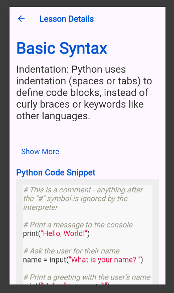

# Videos of the Application

- [Front end Implementation](https://youtu.be/AxqAQxWVTDI)
- [Authentication, App/Business Logic, and Backend](https://www.youtube.com/watch?v=XHxlWsmilSc)
- [Testing, Creating APK File, and Business Model](https://www.youtube.com/watch?v=afMuc7lFjAc)

# Download the APK

- [Menya App APK](https://drive.google.com/drive/folders/13GVaZRTmJpUqAa8tQrv5uUImtSjc5DjK)


# MenyaApp

MenyaApp is a mobile application built using Flutter that aims to provide comprehensive learning resources for Python programming concepts. It includes various courses that cover essential topics such as typecasting, exceptions, functions, lists, tuples, sets, and dictionaries. Each course provides detailed lessons with Python code snippets for practical understanding.

## Features

- **Courses Overview**: View a list of available courses on Python programming.
- **Detailed Lessons**: Tap on a course to access detailed lessons with rich content and code examples.
- **Syntax Highlighting**: Python code snippets are displayed with syntax highlighting for better readability.
- **Navigation**: Seamless navigation between courses and back to the courses list.
- **Responsive Design**: App UI is designed to work smoothly on both Android and iOS devices.

## Screenshots




## Installation

To run this application on your local machine, follow these steps:

1. **Prerequisites**:
    - Make sure you have Flutter installed. If not, [install Flutter](https://flutter.dev/docs/get-started/install).
    - Have an Android emulator or iOS simulator set up, or connect a physical device.

2. **Clone the repository**:
   ```bash
   git clone https://github.com/winnyineza/MenyaApp.git
   ```

3. **Navigate to the project directory**:
   ```bash
   cd menya_app
   ```

4. **Install dependencies**:
   ```bash
   flutter pub get
   ```

5. **Run the app**:
   ```bash
   flutter run
   ```

## Contributing

Contributions are welcome! If you'd like to contribute to MenyaApp, please follow these steps:

1. Fork the repository.
2. Create a new branch (`git checkout -b feature/your_branch_name`).
3. Make your changes.
4. Commit your changes (`git commit -am 'Add new feature'`).
5. Push to the branch (`git push origin feature/your_branch_name`).
6. Create a new Pull Request. 
